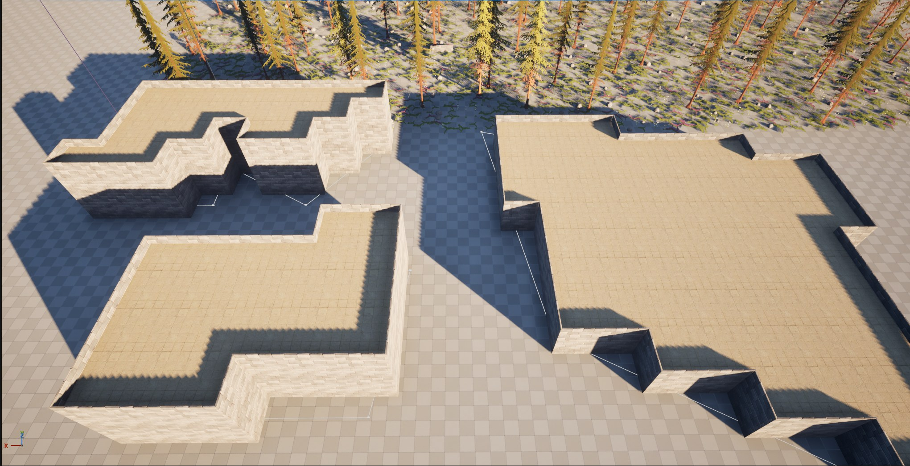
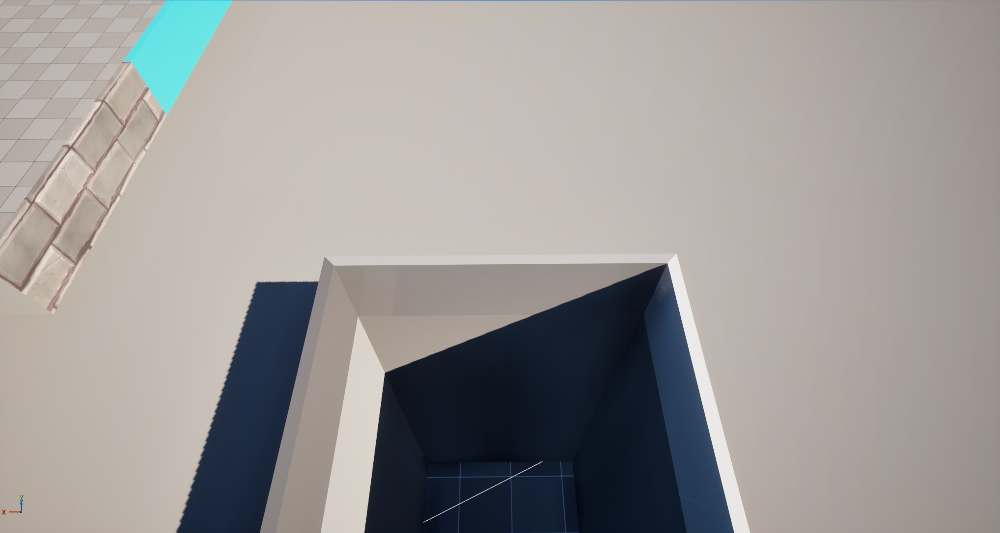
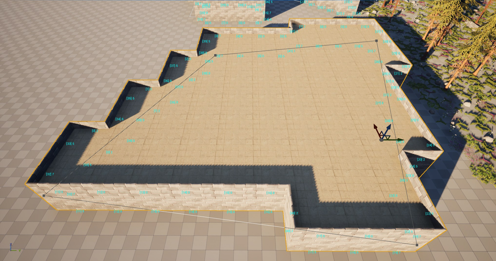
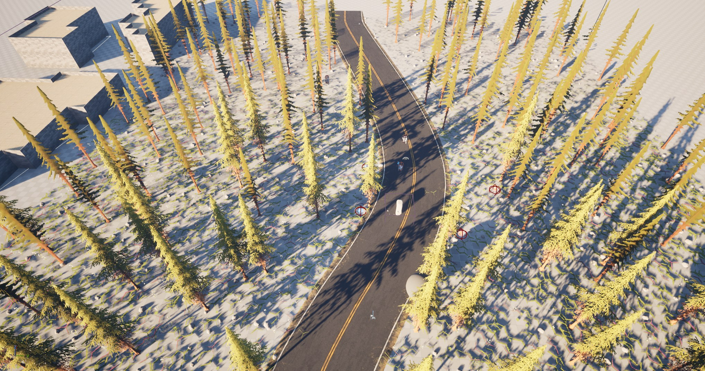

# Plotopia

**UE5 程序化场景生成 + 动作玩法 Demo**（个人项目）

> **引擎版本**：Unreal Engine 5.7 ｜ **开发周期**：2026.02 – 至今（持续迭代）｜ **蓝图 + C++ 协同**

一个由建筑学背景开发者独立完成的 UE5 项目，**核心探索 PCG（Procedural Content Generation）程序化内容生成在关卡与场景搭建中的应用**，并在此基础上落地战斗、敌人 AI、背包等完整玩法系统。

## ✨ 效果展示

| 程序化建筑生成 | 转角模型匹配 |
|:---:|:---:|
|  |  |

| 样条驱动生成 | 场景与植被 |
|:---:|:---:|
|  |  |

**演示视频**：【B 站链接待补充】

---

## 🌲 PCG 程序化内容生成（核心）

### 程序化建筑生成（`PCG/Building/PCG_Building`）

从**样条**出发，按规则批量生成建筑群，是项目的核心作品。

**生成管线**

```
样条定义建筑走向与轮廓
  → Spline Sampler 采样（沿样条布点）
  → Transform Points 逐级变换与偏移（层高、间距、朝向）
  → Difference 去重（消除重叠点）
  → Merge Points 合并
  → 蓝图逻辑处理（墙体 / 地板生成）
  → Static Mesh Spawner 输出网格
```

**参数驱动**

通过 `GetActorProperty` + `AttributeMathsOp` 读取外部 Actor 参数，建筑的**尺寸、层数、间距**可在关卡中实时调控，实现"改参数即改结果"的可配置生成流程，无需修改 PCG 图。

### 转角匹配机制（技术难点）

程序化建筑的难点在于**转角处理**——墙段端点该用直墙、L 形转角还是 T 形 / 十字，取决于周围 8 个方向是否存在其他墙点。

本项目的解决思路是 **探针（Probe）+ 编号（CornerNumber）+ 查表匹配**：

| 步骤 | 实现 |
|---|---|
| **1. 探针定位** | 从当前墙点出发，沿自身**前向（Forward）**与**右向（Right）**各偏移一个间距，可到达周围 8 个相邻位置。间距取整格 → 四个正方向；取半格（间距 ÷ 2）→ 四个对角方向；方向正负通过乘 `-1` 控制 |
| **2. 占用检测** | 用 `HasCurrentPoint` 判断该位置是否存在墙点，返回布尔值 |
| **3. 编号组合** | 多个探针结果经布尔组合判定转角类型，结果累加得出**转角编号 CornerNumber** |
| **4. 查表匹配** | `CornerNumber` 写入 PCG Metadata 向下传递，`BP_MatchingMesh` 按编号索引 `AllowedTypes` 数组，选出对应模型 |
| **5. 手工覆盖** | 支持通过 Metadata **指定 Index 直接替换模型**——程序化生成难以 100% 满足美术需求，保留人工干预接口是必要的 |

**已知局限与改进方向**

当前用蓝图节点实现探针与布尔组合，导致 `BP_SetCornerNumber` 膨胀到 **400KB / 上百节点**，手工连线容易出错、维护成本高。
优化方向：这套逻辑本质是**位掩码（Bitmask）**——8 个方向各占 1 bit，一次循环即可算出 0–255 的掩码再查表。改用 C++ 自定义 PCG 节点可将上百节点压缩为几十行代码，同时提升生成性能。

### 场景与道具程序化生成

- **植被生成**：基于 Surface Sampler 表面采样 + 密度控制规则生成森林植被，控制分布密度、种类与朝向
- **道路生成**：沿 Spline Sampler 采样生成道路与沿路内容，结合曲率 / 距离属性过滤控制分布
- **道具组合生成**：按主题规则组合生成场景道具（餐桌 + 锅具 + 座椅、容器、食物等），并用包围盒 / 密度裁剪避免穿模与重叠

### PCG 技术探索

- **GPU 执行**：尝试 PCG 的 GPU 路径（`bExecuteOnGPU`）与 HiGen Grid 分块生成，了解 GPU 生成与数据回读的适用场景
- **GeometryScript 互操作**：结合 `PCGGeometryScriptInterop` 对动态网格做几何操作（静态网格 → 动态网格 → 变换 → 合并），并按 **Polygroup 批量设置材质 ID**，为生成内容自动分配材质

---

## 🗡️ 玩法系统

### 战斗系统（GAS / GameplayAbilitySystem）

- 按 UE 社区标准的 GAS 架构范式实现：**ASC 挂载 PlayerState**（角色重生不丢数据）、AttributeSet 管理属性、GE 驱动数值结算、GC 播放表现反馈、AbilityTask 串联技能流程
- 自定义 `GAS_AttributeSet`：Health / Mana 属性，含网络复制、OnRep 回调与 `PostGameplayEffectExecute` 数值修正（Clamp / 死亡判定）
- 自定义 AbilityTask：`GAS_AttributeChangeTask`（属性变化监听）、`GAS_WaitGameplayEvent`（GameplayEvent 等待）
- 玩家技能：普攻三连（GA_Primary / GA_Secondary / GA_Tertiary）、范围攻击（消耗蓝条 + 冷却 GameplayEffect）、投射物攻击
- GameplayCue：受击特效（GC_BurstImpact / GC_HitReact）、摄像机震动、四方向受击动画、死亡流程
- 集中式 GameplayTags 管理（`GASTags`），技能 / 事件 / 状态全用 Tag 驱动

### 敌人 AI

- 近战 + 远程两类敌人（`BP_Enemy_Melee` / `BP_Enemy_Ranged`）
- 基于 Ability + `AITask_MoveTo` 的"**索敌 → 追击 → 攻击**"循环：随机攻击延迟、到达判定（AcceptanceRadius）、转向目标
- GameplayTags 事件驱动：攻击结束（`EndAttack`）→ 重新索敌，形成完整行为循环，避免 Tick 轮询
- 受击 / 死亡 / 击退状态，远程敌人有独立弹道攻击

### 背包系统（服务器权威 + 复制）

- 36 格背包 + 9 格快捷栏，DataTable（`DT_Items`）驱动物品数据
- 服务器权威架构：客户端操作自动路由到服务器（Add / Remove / Swap / Move 全套可靠 RPC）
- **双通道同步**：属性复制（`OnRep_Items`）+ 完整状态可靠推送（`PushStateToClient` / `Client_ReceiveInventoryState`），保证 UI 刷新确定性；`bApplyingServerState` 标志防止"推送 → 应用 → 广播 → 回推"死循环
- UMG 拖拽交互、滚轮切换快捷栏；死亡时物品随机散落掉落；自定义 `ItemTrace` 碰撞通道实现拾取
- 性能优化：`ItemCountCache` / `EmptySlotCache` 缓存 + `InventoryVersion` 版本号增量刷新

### UI 与输入

- UMG：HUD（血条 / 蓝条）、背包 / 快捷栏界面、主菜单
- `WidgetComponent` 实现角色头顶血条
- Enhanced Input 分类管理：移动 / 技能 / 物品 / 菜单操作

---

## 项目结构

```
Source/Plotopia/
├── Public/ Private/
│   ├── AbilitySystem/          # GAS 核心（ASC / AttributeSet / Abilities / AbilityTasks）
│   ├── Characters/             # 玩家 / 敌人角色
│   ├── GameObjects/            # 投射物等游戏对象
│   ├── GameplayTags/           # 集中式 Tag 定义
│   ├── Items/                  # 背包系统（组件 / 世界物品 / 数据）
│   ├── Notifies/               # 动画通知（近战攻击判定）
│   ├── Player/                 # PlayerController / PlayerState
│   ├── UI/                     # HUD / 背包 / 快捷栏 Widget
│   └── Utils/                  # 蓝图工具库
Content/GAS/
├── PCG/
│   ├── Building/               # ⭐ 程序化建筑生成（PCG_Building / BP_MatchingMesh 等）
│   ├── PCG_Surface             # 表面采样
│   ├── PCG_Spline              # 样条采样
│   ├── PCG_RoadBulid           # 道路生成
│   ├── PCG_Points / PCG_Table  # 道具组合生成
│   ├── PCG_GPU / PCG_Dyn_Mat   # GPU 执行 / GeometryScript 探索
│   └── Junk.umap               # PCG 测试关卡
├── AbilitySystem/              # 技能 / GameplayEffect / GameplayCue 蓝图资产
├── Characters/                 # 角色蓝图与动画
├── Items/                      # 物品蓝图与 DataTable
├── Maps/                       # GASMap（主场景）/ Startup / kaifang
└── UI/                         # 界面蓝图
```

## 运行方式

1. 安装 **Unreal Engine 5.7**（Epic Games Launcher）
2. 右键 `Plotopia.uproject` → **Generate Visual Studio project files**（或直接双击打开）
3. 首次打开会自动编译 C++ 模块（约 10–20 分钟）
4. 打开关卡 `Content/GAS/Maps/GASMap` 运行玩法，或打开 `Content/GAS/PCG/Building/` 下的 PCG 资产查看生成效果

> **所需插件**：GameplayAbilities、PCG、PCGGeometryScriptInterop、CommonUI（已在 `.uproject` 中配置）
> **第三方资产**：Paragon Boris / Paragon Minions、Stylized_Spruce_Forest、Fantastic_Village_Pack（均为 Epic 免费资产，需自行从 Marketplace 下载后放入 Content 目录）

## 技术要点备忘

- **为什么 ASC 放 PlayerState**：角色重生时 PlayerState 不销毁，技能状态与属性得以保留；且 ASC 的网络复制需要稳定的属主
- **背包为什么用可靠 RPC 而非仅靠属性复制**：数组属性复制的时机不可控（可能合并 / 延后），UI 会出现"数据变了但界面没刷新"；可靠 RPC 提供确定性的状态同步通道
- **AI 为什么用事件驱动而非 Tick**：轮询要么频率高浪费性能、要么频率低反应迟钝；用攻击结束的 GameplayEvent 驱动重新索敌，时机准确且开销低
- **PCG 转角匹配为什么用探针**：以"当前点的局部坐标系 + 偏移"统一表达 8 个方向，避免为每个方向单独连线
- **PCG 地形缓存导致的关卡膨胀排查**：曾发现关卡文件异常膨胀（单文件 189MB，超出 GitHub 100MB 限制）。排查定位到 `PCGWorldActor` 将整个地形缓存（`LandscapeCache`）以 `EPCGLandscapeCacheSerializationMode::AlwaysSerialize` 模式序列化进关卡。关闭该序列化模式后，相关数据从 221MB 降至 33MB，关卡保存速度与仓库体积同步改善

## 踩坑记录

| 问题 | 定位 | 解决 |
|---|---|---|
| 蓝图节点爆炸：`BP_SetCornerNumber` 膨胀至 400KB / 上百节点，手工连线易错 | 8 方向探针 + 布尔组合用蓝图表达过于冗长 | 计划改用 C++ 自定义 PCG 节点 + 位掩码重构（见路线图） |
| 关卡文件 189MB、超过 GitHub 单文件限制 | `PCGWorldActor` 的 `LandscapeCache` 被 `AlwaysSerialize` 序列化 | 关闭地形缓存序列化；`__ExternalActors__` 体积 221MB → 33MB |
| 背包 UI 偶发不刷新 | 数组属性复制时机不可控（可能合并 / 延后） | 增加可靠 RPC 状态推送通道 + 版本号兜底 |
| 敌人攻击后不及时重新索敌 | 轮询效率低且时机不准 | 改为攻击结束的 GameplayEvent 驱动 |

## 关于本项目

- **开发方式**：PCG 系统为本人设计实现；GAS 战斗框架基于 UE 社区标准的架构范式（参考官方文档与公开技术资料）；背包等系统结合 AI 辅助编程完成落地
- **第三方资产**：Paragon Boris / Paragon Minions、Stylized_Spruce_Forest、Fantastic_Village_Pack 均为 Epic Games 免费资产，版权归 Epic Games 所有

## 路线图

- [ ] 补充效果截图与演示视频
- [ ] 用 C++ 自定义 PCG 节点重构转角判定（位掩码方案），替代现有蓝图节点
- [ ] 补充 PCG 生成性能数据（CPU / GPU 对比）
- [ ] 扩展关卡设计：完整可玩区域的程序化生成（地形 → 道路 → 建筑 → 植被 → 敌人刷新点）

---

*作者：周尊 ｜ 建筑学背景转游戏开发 ｜ 关注程序化生成与关卡设计方向*
